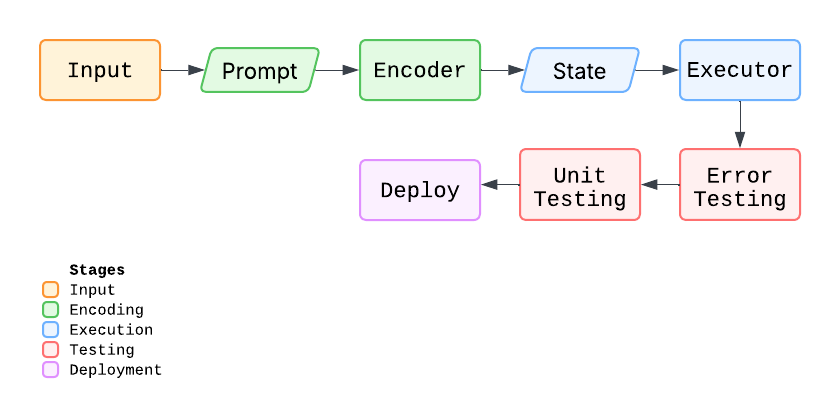

  

Start with an idea. Take that idea all the way to execution in a fraction of the
time of traditional project implementation. This is Djinn.

Djinn is a tool for autonomous project implementation. Given an initial prompt,
Djinn will implement a plan for development while considering project
specifications and best practices. These tasks are then iteratively executed. 
Test steps are included to include branches in the task flow. This effectively
encodes a problem statement into an executable state machine. The code is then
tested for errors and unit tests are generated and validated.

## Architecture

  

### Input
Input is passed in as a config file, 'djinn.toml', in the current directory.
Information from this is injected into a system prompt with the agent's
operating conditions, and a user prompt for generating task encoding nodes. The
system prompt here is saved for future use in prompting.

### Encoding
The encoding prompt generates task nodes, which are executable as a state machine in the execution step. There are three different types of task nodes that may be assigned, ouput nodes, input nodes, and test nodes.

#### Ouput
Ouput nodes simply execute a command.

#### Input
Input nodes wait for a read before transitioning to an ouput node.

#### Test
Test nodes wait for some testing condition to be met before 

## Executor
The task state machine is executed in order of state transitions. It executes
until the final
